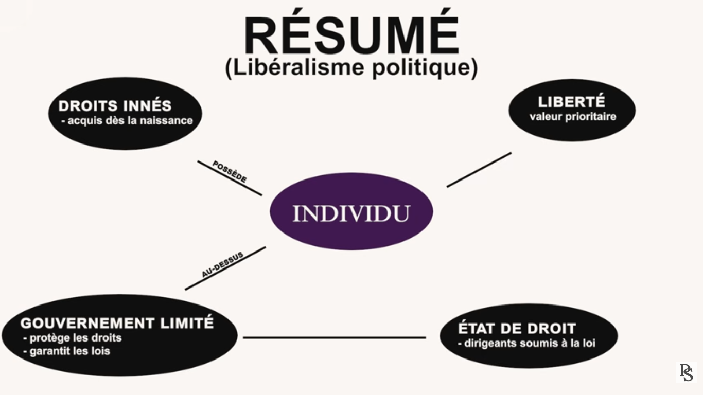
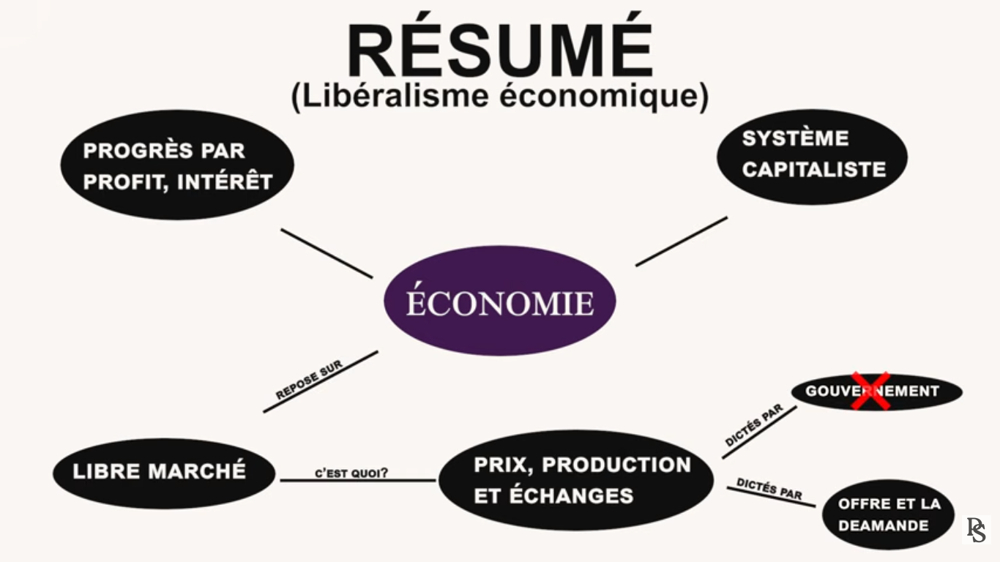

<head>
  <meta property="og:image" content="https://vinnylinux1111.github.io/images/Réalité et Civilisations.png" />
  <meta property="og:image:secure_url" content="vinnylinux1111.github.io/images/Réalité et Civilisations.png" />
  <meta property="og:image:type" content="image/png" />
  <meta property="og:image:width" content="1200" />
  <meta property="og:image:height" content="630" />
  <meta property="og:image:alt" content="A descriptive alt text for your thumbnail image." />
</head>

# Table des matières

* [Introduction](#Introduction)
* [Qu'est-ce que le libéralisme ?](#quest-ce-que-le-libéralisme-)
* [Le libéralisme écononomique](#le-libéralisme-économique)
* [Au Québec et au Canada (et ailleurs)](#au-québec-et-au-canada-et-ailleurs)
* [Discussion](#discussion)
* [Conclusion](#conclusion)
* [Références](#références)

## Introduction

Bonjour à vous, cher lecteur/lectrice ! Je me nomme Vincent et je me présente ici comme un homme averti et vertueux en exploration en matière de philosophie, économique et politique. Je tente du mieux que je peux afin de répondre à plusieurs de mes questionnements internes et de communiquer mes observations, parfois élargies, vis-à-vis des sujets discutés dans mes articles. Voilà ! Bonne lecture ! 

## Qu'est-ce que le libéralisme ? 

Le **libéralisme** est un concept économique et politique pensé et créé par des philosophes des Lumières du 17e siècle dont **John Locke**, un anglais, en fait partie. Ce nouveau mouvement de pensée avait été mis de l'avant en réponse à la révolution anglaise, à la fin du 17e siècle.  Auparavant, la royauté avait tout le pouvoir de décision sur l'administration du royaume, donc les individus (autrement dit les citoyens) n'avaient pas ou avaient une quantité très minime de pouvoirs. Plusieurs injustices sociales, entre autres, étaient présents à cette époque. C'est là que John Locke s'était mis à l'avant scène avec ses nouvelles idées, qui sont encore présents de nos jours[¹ ² ³ ⁴]. 

Son idée principale se résumait ainsi de manière paraphrasée : *"Si le pouvoir du roi vient de Dieu [...] et si maintenant le pouvoir venait plutôt des individus. Chaque être humain possède des droits naturels et le rôle du gouvernement n'est pas de contrôler les gens mais de protéger ses droits."*[⁴] Le transfert des pouvoirs du roi vers les individus était un changement grandiose dans la manière de vivre et de voir les choses à l'époque de John Locke ! 

Alors, voici quelques détails qui résument les idées de John Locke concernant le libéralisme [⁴]:
- Mettre l'accent sur la liberté et les droits de l'individu. Les individus sont libres et autonomes et qu'ils doivent disposer d'une large sélection de libertés civiles, politiques et économiques.
- Défendre des principes tels que la liberté d'expression, la liberté de religion, la liberté de presse, la liberté de réunion et le droit de manifester. 
- Et tous les points précédents doivent être possibles dans un environnement avec absence de répression.
- Dans le domaine politique, on y fait la promotion de la démocratie et de la participation citoyenne. Il y a plusieurs moyens par lesquels les citoyens prennent part à la vie publique et aux décisions collectives, au-delà du vote. En voici quelques exemples : 

|                                                            |                                                               |
| ---------------------------------------------------------- | :-----------------------------------------------------------: |
| Participer à des consultations publiques                   |                 Signer ou lancer une pétition                 |
| Assister à un conseil municipal                            |             Manifester ou militer pour une cause              |
| S'impliquer dans une association ou dans un comité citoyen | Débattre et s'informer (médias, réseaux sociaux, forums, etc) |

 - Les citoyens ont la liberté de choisir leurs dirigeants par une période d'élection libre, et l'État n'a aucun droit de révoquer ses droits. 

 En somme, dans le libéralisme classique (de John Locke), l'État doit intervenir le moins possible dans la société, uniquement pour fixer les règles de base (par exemple, la sécurité policière, la justice et la propriété privée) et de protéger les libertés individuelles, comme par une Charte des Droits et Libertés de la Personne. Le peuple peut ainsi se révolter lorsque le gouvernement échoue à son rôle et à ses responsabilités. Le libéralisme prône aussi la responsabilité envers la société et la solidarité. C'est donc d'équilibrer la liberté individuelle avec la liberté sociale. 

<figure>
  
  <figcaption>Figure 1: Résumé pour le libéralisme politique, SOURCE : [⁴] <a href="https://www.youtube.com/watch?v=dn5cKebl4w4" target="_blank">https://www.youtube.com/watch?v=dn5cKebl4w4</a></figcaption>
</figure>

### Le libéralisme économique

À travers les siècles, les hommes ont cherché à savoir comment se créer de la richesse et comment la définir. Voici comment était pensée libéraliste du 18e siècle. 

>Au siècle des Lumières (au 18e siècle), l'économie anglaise décolle en voyant **son industrie prospérer grâce au capitalisme industriel et aux échanges.** [...] À la fin de ce siècle, plusieurs économistes théorisaient l'idée qu'un lien très fort unissait liberté et prospérité.[³]
 
Au 16e et 17e siècle, en Europe, il y avait un système économique appelé le mercantilisme, soit un système économique dont la richesse et la puissance d'un État se mesure à la quantité d'or et de monnaie qu'il possède, donc plus un État a de métaux précieux, plus il est puissant.[⁷]

Le philosophe économique britannique, Adam Smith, s'était servi de ce qui existait et y avait dressé les grandes lignes et les bénéfices de cet ancien exercice. C'était à la fois pour l'améliorer selon sa philosophie et pour ainsi définir sa perception du libéralisme au niveau économique. Une nouvelle notion d'Adam Smith, soit le libre marché, est un système économique dans lequel l'offre et la demande "guide" la production et les échanges commerciaux. Adam Smith soutient, dans le cadre de sa philosophie, les principes de la propriété privée, de la concurrence et de la liberté d'entreprendre, considérant que ça favorise l'innovation et la prospérité. **C'est donc un système capitaliste dont la recherche du profit et de l'intérêt personnel sont la "base du progrès".** [⁴]

Dans le libéralisme économique et politique, ce sont les individus qui prennent les décisions, pas l'État. De plus, ce système encourage la compétition entre les individus, tant dans le domaine des échanges commerciaux que dans le domaine politique. Ça va dans la même veine que le libéralisme, expliqué plus haut, qu'il faut une très faible assistance de l'État dans les systèmes économiques.[⁴]

<figure>
  
  <figcaption>Figure 2: Résumé pour le libéralisme économique, SOURCE : [⁴] <a href="https://www.youtube.com/watch?v=dn5cKebl4w4" target="_blank">https://www.youtube.com/watch?v=dn5cKebl4w4</a></figcaption>
</figure>

## Au Québec et au Canada (et ailleurs)

L'exemple des marchés boursiers aux États-Unis et au Canada est que ceux-ci ne sont nullement gérés par l'État. Ce sont des centres où des gens observe les fluctuations des marchés, qui sont gérés par l'offre et la demande. Parfois, au Canada, on observe des actions politiques pour promouvoir le marché canadien à l'international pour mettre les "travailleurs canadiens" de l'avant afin de promouvoir de nouveaux marchés qui donneraient du travail à travers le Canada ou dans des provinces spécifiques à des types de marché. On y connait notamment, entre autres, l'acier, l'aluminium pour l'industrie automobile ou des semiconducteurs dans les domaines de la technologie. Donc, il semblerait que l'État (canadien et québécois) aide ou participe à une bonne gestion de l'économie. 

On y observe dans les États du Québec et du Canada des programmes d'aide financière et d'aide au travail ou des programmes à la retraite pour les citoyens, entre autres.

C'est donc dire, ici, qu'on reconnait des éléments du libéralisme classique à travers le Québec et surtout au Canada.

## Discussion 

> "Certaines critiques estiment que sans régulation suffisante, le libéralisme peut accentuer les inégalités, c'est-à-dire de concentrer les richesses et d'affaiblir la solidarité sociale." [⁴]

De mes propres observations, j'observe que l'avènement du libéralisme a eu un effet très majeur sur les anciens régimes féodaux. Le peuple a maintenant un pouvoir considérable, ce qui était totalement différent auparavant et à plusieurs niveaux. On peut ainsi dire que le peuple peut s'exprimer plus librement sans que l'État ou la royauté puisse réfuter les idées des gens, à plusieurs égards et dans plusieurs domaines, dépendamment du pays où cette philosophie du libéralisme s'applique. C'est en cet aspect que c'était une toute nouvelle époque ! De plus, pour les gens qui se faisait appelé "les marchands" et/ou les "économistes" et/ou les "commerçants", ces gens-là bénéficient une plus grande liberté, tel qu'expliqué plus haut, dans la section "libéralisme économique". 

Cependant, tout n'est pas rose dans la question du libéralisme, mais je ne crois pas, en mes observations que c'était très évident lorsque le libéralisme fût créé. Bien que le libre marché sert, entre autres, à encourager l'innovation et à garantir la liberté de choix pour les consommateurs et les entreprises et à partager les connaissances, on observe, **notamment au 21e siècle**, que le libre marché a tendance à creuser des inégalités économiques et sociaux et à créer des monopoles puissants et à ignorer les coûts sociaux et environnementaux, comme la pollution atmosphérique. Il néglige aussi les biens essentiels non rentables, par exemple, les logements abordables et les services publics, et mène parfois, et malheureusement, à des crises financières et sociales. Un autre argument qui n'est pas grandement discuté, c'est le manque de moral et/ou de vertu chez ces personnes qui cherchent toujours à faire plus de profits au dépens d'autrui et de l'environnement.[⁶] Alors, si le libéralisme soutient le libre marché, voilà ce que ça peut aussi engendrer !  

**Fait curieux, il est à noter que le Canada est jusqu'à maintenant une monarchie constitutionnel du Royaume-Uni, soit le pays d'origine des 2 philosophes mentionnés plus haut soit John Locke et Adam Smith.** 

## Conclusion 

Donc, il va de soi qu'il y a des bons côtés et des côtés moins roses dans la question du libéralisme. Pour employer des mots justes et positifs, le libéralisme a, jusqu'ici, amené une meilleure qualité de vie globale chez les gens comparativement à la qualité de vie dans le moyen âge, selon les textes historiques. Suite à nos observations, il y a notamment et évidemment place à de l'amélioration, par exemple, si on vise un meilleur équilibre dans tous les aspects de la vie et aussi à mieux définir le concept de richesse, soit plus globalement que par une dimension économique du terme.

# Références

[¹] [Wikipédia](https://fr.wikipedia.org/wiki/Lib%C3%A9ralisme)

[²] [Libéralisme raconté par RÉCIT Univers social - Youtube](https://www.youtube.com/watch?v=bWTI0UR13wo)

[³] [Qu'est-ce que le libéralisme - Youtube](https://www.youtube.com/watch?v=WfRt-9tEBBU)

[⁴] [Le libéralisme expliqué simplement (politique et économique - Youtube) ](https://www.youtube.com/watch?v=dn5cKebl4w4)

[⁵] [La “main invisible” chez Adam Smith, c’est quoi ?](https://www.philomag.com/articles/la-main-invisible-chez-adam-smith-cest-quoi)

[⁶] [Il a côtoyé l’élite mondiale… ET IL DIT TOUT ! 🔥 👉 Felix Marquardt @TheBlackElephantExperience](https://www.youtube.com/watch?v=vkSw4Y1qOd0)

[⁷] [Le mercantilisme, Histoire, Alloprof](https://www.youtube.com/watch?v=H7kSa5IqdFE)

